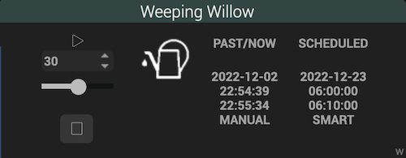

# Netro Arrosage (Watering) plugin

This plugin allows you to manage the [*Netro*](https://Netrohome.com/) ecosystem allowing, thanks to its controller and all of its sensors, to ensure the automatic watering of your garden. It relies on *Netro*'s [Public API](http://www.Netrohome.com/en/shop/articles/10).

## Description

The *Netro* controller is connected to the solenoid valves which will each water a particular area of ​​your garden. The maximum number of zones that can be managed depends on the controller model you have. Only the zones actually connected to the solenoid valves can be managed by the *Netro* system and therefore by the plugin.

The plugin defines three types of equipment:

* controller
* zones controlled by the controller
* soil sensors that measure the humidity and temperature of the soil as well as the amount of light received

The plugin allows you to manage a controller and all the zones and sensors that are part of your system.

## Configuration

Before doing anything, you must enter the *serial number of the controller* and those of your *soil sensors*. You can find these serial numbers in the *Netro* app on your smartphone.

Controller data is refreshed every 5 minutes (cron5) and sensor data every 10 minutes (cron10). You can also refresh manually from the controlling equipment. **It is important not to abuse these "refresh" as *Netro* limits the number of calls per day to 2000**.

It is likely that you decide not to water at certain period of time during the night, in this case we can slow down the refresh rate by defining a *slowdown factor* over the period concerned. The formalism is mentioned a little further down in the **advanced functions** section.
This parameter is optional.

The *default parent object* designates the object to which you attach your Jeedom *Netro* equipment (here *Jardin*).

## Creation of equipment

At the end of the first installation, the main page of the plugin does not present any equipment. The equipment that corresponds to your *Netro* system will be generated by the plugin during the synchronization phase that you will have triggered using the "Synchronize" button at the top left.

The serial numbers provided in the configuration page will be used to discover your *Netro* environment. If you have not provided them beforehand, the synchronization will have no effect.

## Equipment

### Controller

In the controller, we find the *Action* commands for *starting* and *stopping* watering, for *activating/deactivating* the system.

Starting a watering from the *controller* will start watering all active *zones*. If the system is configured to prevent simultaneous watering on several zones, the watering starts on a first zone and the waterings on the other zones are scheduled to occur in sequence, one after the other. In this context, *Netro* allows you to indicate the time it may be necessary to wait between two waterings - to be set directly in the *Netro* app -.

The *no water* action allows you to indicate to *Netro* that you want to suspend any planned watering in the following days, the number of days will be indicated as a parameter.

On the side of the *Info* commands, we will note the *status* of the controller in the sense of *Netro* ("ONLINE", "STANDBY", "WATERING", ...), which will result in particular from the *activation/deactivation* commands and *start* and *stop* watering controls. Two binaries are offered: *Active* - to indicate that the controller is not in standby mode - and *Watering in progress*.

When you want to start irrigation of only one zone, you may apply the *start* irrigation command to the equipment representing the given *zone* (see later in this document in the section "Zones").

Note that the number of calls made since midnight to the [Public API](http://www.*Netro*home.com/en/shop/articles/10) is indicated in the information section of the equipment main page near to the maximum number of authorized calls. These are the *number of tokens remaining* and the maximum *number of tokens* as shown below.

### Zones

In *zone* type equipment, we find the actions of *starting* and *stopping* irrigation. As in the controller, we find the binary info command indicating whether *watering is in progress*.

In addition, we find all the information relating to the last watering whether it is finished or not: its *status* (is it finished or still in progress), its *source* (manual or planned start), its *date/time of start* and its *end time*, past or forecast if watering is still in progress.

In a completely symmetrical way, we find the information relating to the next planned watering, considering that the planning has been carried out.

### Soil sensors
 
The equipment representing the soil sensors contain the information inherent in the reading carried out by the sensors at regular intervals, namely the temperature, the humidity and the luminosity. The battery level, which must be taken care of since it depends on the brightness, is also displayed.

## Advanced functions

### slowndown factor

As mentioned above, the number of calls to the [Public API](http://www.Netrohome.com/en/shop/articles/10) of *Netro* is limited. Today, a maximum of 2,000 calls per day is permitted and the counter is reset every day at midnight. *Netro* does not provide mechanisms that reference a callback function, as do a number of similar systems, so that each event is notified as it occurs. For this reason, it is useful to frequently resquest the system to obtain a state of the situation as faithful as possible to reality at t time. 

The choice that was made for this plugin is to interrogate the controller every 5 minutes and the sensors every 10 minutes thanks to the corresponding type of cron. This frequency seems satisfactory in the general case, in particular during periods when watering activity is highly probable. On the other hand, at certain period of times during the day and especially at night, the activity is reduced or even reduced to 0 through the restrictions that one can impose in the *Netro* configuration, through its application. 

The *slowdown factor* parameter will reduce the refresh rate at certain times. On a single configuration line, you can indicate a series of triples (start time, end time, deceleration coefficient).

For example, indicating "23:00.05:30.6;11:00.17:50.3" as the slowdown factor means that you want:

* multiply by 6 the time between two refreshments between 11 p.m. and 5:30 a.m.; this means refreshing the controller every 5x6 = 30 mins and the sensors every hour between 11 p.m. and 5:30 a.m.
* multiply by 3 only between 11 a.m. and 5:50 p.m., i.e. a refresh period of 15 minutes for the controller and 30 minutes for the sensors.

It is thus possible, without degrading the relevance of the equipment, to limit the number of calls per day to the [Public API](http://www.Netrohome.com/en/shop/articles/10) of *Netro* and stay comfortably within the imposed limit.

## Examples of integration in Jeedom Connect

