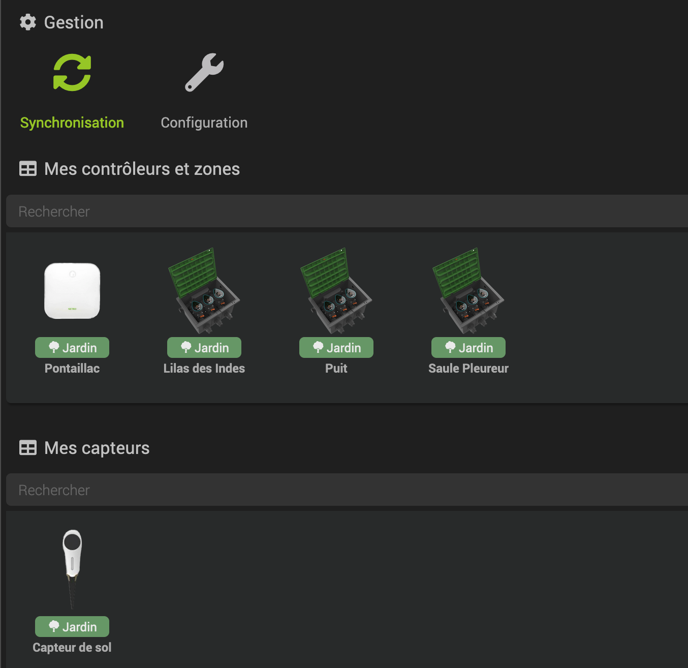
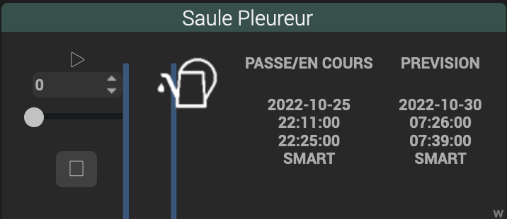
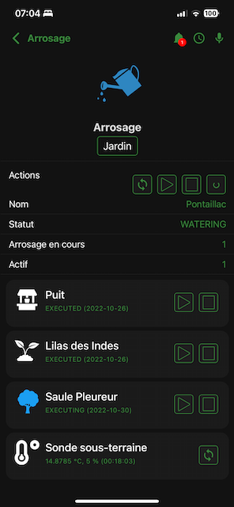
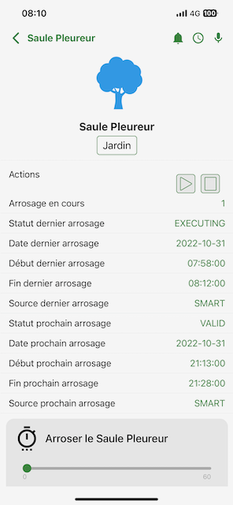

# Plugin Netro Arrosage

Ce plugin permet de gérer l'écosystème [*Netro*](https://Netrohome.com/) permettant, grace à son contrôleur et l'ensemble de ses capteurs, d'assurer l'arrosage automatique de votre jardin. Il s'appuie sur l'[API Public](http://www.Netrohome.com/en/shop/articles/10) de *Netro*.

## Description

Le contrôleur *Netro* est relié aux electrovannes qui vont chacune arroser une zone particulière de votre jardin. Le nombre de zones maximum pouvant être gérées dépend du modèle de contrôleur que vous possédez. Seules les zones effectivement connectées aux electrovannes pourront être gérées par le système *Netro* et par conséquent par le plugin.

Le plugin définit trois types d'équipement :

* le contrôleur
* les zônes pilotées par le contrôleur
* les capteurs de sol qui permettent de mesurer l'humidité et la température du sol ainsi que la quantité de lumière reçue

Le plugin permet de gérer un contrôleur et l'ensemble des zones et capteurs qui font partie de votre système.

## Configuration

Avant de faire quoique ce soit, il faut renseigner le *numéro de série du contrôleur* et ceux *des capteurs* de sol que vous possédez. Vous trouverez ces numéros de série dans l'app *Netro* sur votre smartphone.

Les données du contrôleur sont rafraîchies toutes les minutes ou toutes les 5 mn (selon que cron ou cron5 est coché) et celles des capteurs toutes les 10 mn (cron10). On peut également rafraîchir manuellement à partir de l'équipement contrôleur. **Il est important de ne pas abuser de ces "refresh" dans la mesure ou *Netro* limite à 2000 le nombre d'appels par jour à son API**.

Il est probable que vous décidiez de ne pas arroser à certaines heures de la nuit, dans ce cas on pourra ralentir la fréquence de rafraîchissement en définissant un *facteur de ralentissement* sur la période concernée. Le formalisme est évoqué un peu plus bas dans la rubrique **paramètres avancés**.
Ce paramètre est optionnel.

Le plugin permet, au travers de ses commandes, de consulter l'historique et les prévisions d'arrosage sur une période de temps qui se définit par *le nombre de mois avant et après* la date courante. Netro propose une fenêtre par  défaut de *un mois avant* et *un mois après*. L'écran de configuration permet d'élargir cette période si besoin. 

L'*objet parent par défaut* désigne l'objet auquel vous souhaitez rattacher vos équipements Jeedom *Netro* (ici *Jardin*).

## Création des équipements

A l'issue de la première installation, la page principale du plugin ne présente aucun équipement. Les équipements qui correspondent à votre matériel *Netro* seront générés par le plugin pendant la phase de synchronisation que vous aurez déclenchée grâce au bouton "Synchroniser" en haut à gauche. Les noms du contrôleur et des zones sont empruntés à *Netro*, aussi faut-il qu’ils soient disponibles pour l’objet de rattachement (il faut que le nom *Pontaillac* dans *Jardin* ne soit pas déjà utilisé au moment de la synchronisation dans l’exemple ci-dessous). Les capteurs sont nommés *capteur de sol* suivi d’un numéro d’ordre quand il y en a plusieurs.

On peut renommer à souhait tous les équipements ainsi générés. On peut également refaire une synchronisation si l’on souhaite refléter des changements opérés avec l’application *Netro* sans prendre le risque de détruire tout ce qui aura pu être configuré précédemment. 

Les numéros de série fournis dans la page de configuration seront utilisés pour retrouver votre environnement *Netro*. Si vous ne les avez pas fournis au préalable la synchronisation n'aura aucun effet.

## Les équipements

### Le contrôleur

On retrouve dans le contrôleur les commandes *Action* de *démarrage* et *arrêt* de l'arrosage, d'*activation/désactivation* du système. 

Démarrer un arrosage depuis le *contrôleur* a pour effet de lancer l'arrosage de toutes les *zones* actives. Si le système est configuré pour empêcher l'arrosage simultané sur plusieurs zones, l'arrosage démarre sur une première zone et les arrosages sur les autres zones sont planifiés pour se réaliser en séquence, l'une après l'autre. Das ce contexte, *Netro* permet d'indiquer le temps qu'il peut être nécessaire d'attendre entre deux arrosages - à paramétrer dans l'app *Netro* directement -.

L'action *suspendre la planification* permet d'indiquer à *Netro* que l'on souhaite suspendre toute arrosage planifié dans les jours qui suivent, on indiquera le nombre de jours en paramètre.

Du coté des commandes *Info*, on notera le *statut* du contrôleur au sens de *Netro* ("ONLINE", "STANDBY", "WATERING", ...), qui découlera notamment des commandes *activation/désactivation* et des commandes de *démarrage* et d'*arrêt* de l'arrosage. Deux commandes *Info* binaires sont proposées : *Actif* - pour indiquer que le contrôleur n'est pas en standby - et *Arrosage en cours*.

Quand on souhaite lancer l'arrosage d'une zone uniquement, on applique la commande de démarrage de l'arrosage sur l'équipement représentant la *zone* concernée (voir plus loin dans ce document dans la rubrique "Les zones").

On peut noter que le nombre d'appels effectués depuis minuit à l'[API Public](http://www.*Netro*home.com/en/shop/articles/10) est indiqué dans la rubrique information de la page principale de l'équipement avec le nombre maximum d'appels autorisés. Il s'agit du *nombre de jetons restants* et du *nombre de jetons max* comme illustré ci-dessous.

### Les zones

On retrouve dans les équipements de type *zone* les actions de *démarrage* et d'*arrêt* de l'arrosage. On retrouve comme dans le contrôleur la commande *Info* binaire indiquant si l'*arrosage* est *en cours*.

Par ailleurs, on retrouve toutes les informations relatives au dernier arrosage qu'il soit terminé ou non : son *statut* (est-il terminé ou toujours en cours ?), son origine (démarrage manuel ou planifié), sa *date/heure de démarrage* et son *heure de fin*, passée ou prévisionnelle si l'arrosage est toujours en cours.

De manière totalement symétrique on retrouve les informations relatives au prochain arrosage planifié, à considérer que la planification ait été effectuée.

### Les capteurs de sol
 
Les équipements représentant les capteurs de sol renferment les informations inhérentes au relevé effectué par les capteurs à intervalle régulier, à savoir la température, l'humidité et la luminosité. Le niveau de batterie, auquel il faut veiller puisque qu'il dépend de la luminosité, est également affiché.

## Paramètres avancés

### facteur de ralentissement

Comme évoqué plus haut, le nombre d'appels à l'[API Public](http://www.Netrohome.com/en/shop/articles/10) de *Netro* est limité. Aujourd'hui c'est 2000 appels par jour qui peuvent être effectués au maximum et le compteur est remis à 0 tous les jours à minuit. *Netro* ne fournit pas de mécanismes faisant référence à une fonction de rappel (callback), comme c'est le cas pour un certain nombre de systèmes similaires, pour que chaque événement soit notifié au moment où il se produit. Pour cette raison, il est utile d'interroger fréquemment le système pour obtenir un état de la situation le plus fidèle possible à la réalité à l'instant t. 

Le choix qui a été fait pour ce plugin consiste à interroger le contrôleur toutes les minutes ou toutes les 5 mn (au choix par configuration) et les capteurs toutes les 10 mn grâce au type de cron correspondant. Cette fréquence semble satisfaisante dans le cas général, en particulier pendant les périodes où l'activité d'arrosage est fortement probable. En revanche, à certaines périodes de la journée et surtout de la nuit, l'activité est réduite voire même ramenée à 0 à travers les *restrictions* que nous pouvons imposer dans la configuration *Netro* à travers son application. 

Le paramètre *facteur de ralentissement* va permettre de réduire la fréquence de rafraîchissement à certaines périodes. Sur une seule ligne de configuration on pourra indiquer une suite de triplet (heure de début, heure de fin, coefficient de ralentissement).

Par exemple, indiquer "23:00,05:30,6;11:00,17:50,3" comme facteur de ralentissement signifie que l'on souhaite :

* multiplier par 6 le temps entre deux rafraîchissements entre 23h et 5h30; cela signifie rafraîchir le contrôleur toutes les 5x6 = 30 mn (si cron5 a été coché dans la configuration) et les capteurs toutes les heures entre 23h et 5h30
* multiplier par 3 seulement entre 11h et 17h50 c'est à dire une période de raffraichissement de 15 mn pour le contrôleur et 30 mn pour les capteurs.

On peut ainsi, sans dégrader la pertinence des équipements, limiter le nombre d'appels par jour à l'[API Public](http://www.Netrohome.com/en/shop/articles/10) de *Netro* et rester confortablement dans la limite imposée.

## Exemples d'intégration dans Jeedom Connect

